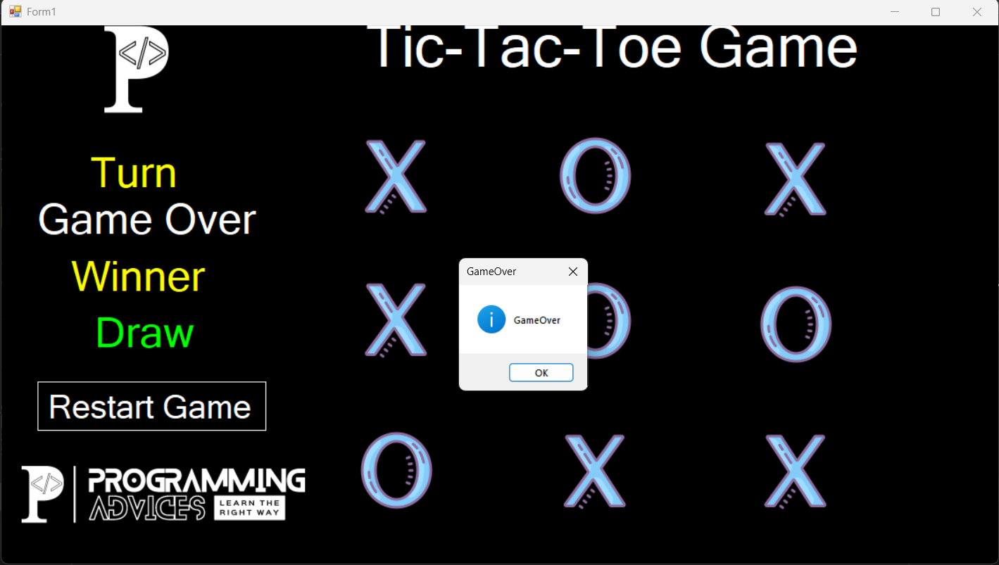

# Tic-Tac-Toe (XO Game) 🎮

A two-player Tic-Tac-Toe desktop game built with **C#** and **Windows Forms (.NET Framework)**, developed to apply the concepts learned in Dr. Mohammad Abu-Hadhoud's C# Level 1 course on [Programming Advices](https://www.programmingadvices.com).

---

## Screenshots

> Game in progress — Player 1's turn

> Player 1 wins — top row highlighted in green

> Player 2 wins — top row highlighted in green

> Draw — board full with no winner

---

## Features

- Two-player mode (Player 1 = X, Player 2 = O)
- Tracks whose turn it is in real time
- Detects and highlights the winning row, column, or diagonal in green
- Detects a draw when the board is full
- Displays game status: In Progress / Winner / Draw
- Restart game button to reset the board instantly
- Clean black-themed UI with the Programming Advices branding

---

## How to Play

1. Player 1 clicks any cell to place **X**
2. Player 2 clicks any cell to place **O**
3. First player to get 3 in a row (horizontal, vertical, or diagonal) wins
4. If all 9 cells are filled with no winner, it's a **Draw**
5. Click **Restart Game** to play again

---

## Tech Stack

| | |
|---|---|
| Language | C# |
| Framework | .NET Framework |
| UI | Windows Forms (WinForms) |
| IDE | Visual Studio Community |

---

## Course Info

This project was built to apply concepts from **C# Level 1** by Dr. Mohammad Abu-Hadhoud on the [Programming Advices](https://www.programmingadvices.com) platform — a course covering C# syntax, .NET Framework fundamentals, and Windows Forms desktop application development. It is one of multiple projects implemented throughout the course.

---

## Author

**Yusuf Shaaban Arja**
